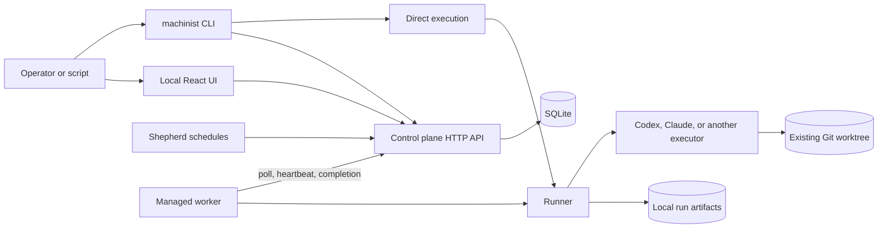
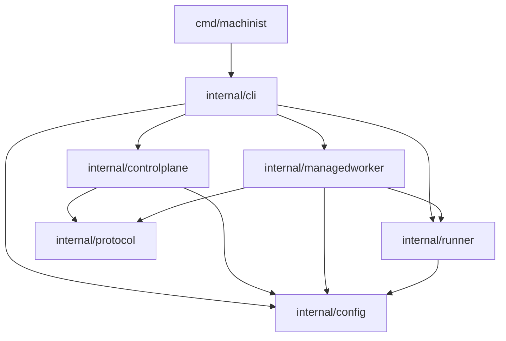

# Machinist architecture

## Executive summary

Machinist runs trusted coding-agent definitions against existing local Git worktrees. Its
source of truth is split on purpose: `config.toml` owns shared agent prompts and pipelines,
while `worker.toml` owns machine-local executor commands, repository paths, credentials,
and the control-plane connection. The direct path resolves both files in one process. The
managed path stores jobs in SQLite and leases each resolved run to a compatible worker.

The most important rule is that the control plane sends intent, never machine authority.
It may send a final rendered prompt, logical executor and repository names, a timeout, and
an opaque lease. Only the worker can turn those names into a command, local path, process
environment, and credentials.

### System architecture

The control plane and UI are local-only in the implemented server. A managed worker may
connect over loopback HTTP or to a non-loopback HTTPS URL.

### Dependency hierarchy

Dependencies point from entry points and orchestration toward configuration, protocol,
and execution primitives. The runner does not know about HTTP, jobs, pipelines, issue
labels, or prompt templates. The protocol does not know about local paths or commands.

## Configuration and ownership

`config.toml` is the shared definition file. It declares the local control-plane server,
agents, ordered pipelines, and optional per-repository Shepherd schedules. Each agent
selects an executor by logical name, points to a prompt file, and may set a timeout. Prompt
paths are resolved relative to this file. A Shepherd schedule supplies a logical repository,
interval, and maximum actions per run. The server may also set a positive global concurrent
job limit. An omitted limit allows every available worker to lease a different job.

`worker.toml` is machine-local. It declares executor argument arrays, optional model alias
maps, repository-name to path mappings, a data directory, and the control-plane URL and
token file. Relative paths are resolved from the worker file. Unknown TOML fields fail
loading, which prevents misspelled settings from being ignored.

Configuration files are limited to 1 MiB. An agent prompt and an input prompt are each
limited to 256 KiB, and the rendered prompt is limited to 512 KiB. The only supported
prompt parameter is `{{machinist.prompt}}`. Model selection uses a separate
`{{machinist.model}}` executor argument placeholder. Neither parameter is evaluated by a
shell.

`machinist init` installs embedded example definitions under `~/.machinist`. It creates files
with mode `0600`, directories with mode `0700`, and never overwrites an existing regular
file.

## Direct execution

`machinist run` and `machinist worker run` use the same local execution flow:

1. The CLI loads `worker.toml` and resolves the shared `config.toml` path.
2. It loads one agent or the agents in one pipeline from the shared definition.
3. It validates the input prompt and renders it into each agent prompt.
4. It resolves the repository to the root of an existing Git worktree.
5. The worker definition maps the logical executor to an argument array and resolves the
   optional model alias.
6. The runner starts the executor without a shell, writes the rendered prompt to standard
   input, and streams standard output and error live.
7. For a pipeline, the CLI repeats the flow in order and stops at the first non-successful
   process outcome.

The runner starts the configured command directly with `os/exec`. It removes repository-
selection Git variables from the inherited environment, then adds the run ID, resolved
repository, and optional token-usage output path. It does not filter other environment
variables. The configured executor and its prompt therefore belong to the trusted local
automation boundary.

## Managed execution

The managed path adds durable admission and leasing while reusing the same runner:

1. `machinist submit` reads the worker token, fetches the control-plane catalog, validates
   the logical repository and agent or pipeline, and submits the request with bearer
   authentication.
2. The control plane reloads the shared definition, resolves and renders every selected
   agent, and stores one job plus ordered run rows in a SQLite transaction. Only the first
   run is queued. Later pipeline steps remain pending.
3. A managed worker polls with its random process instance ID, display name, executor
   names, repository names, and model capabilities.
4. SQLite records the worker, reclaims expired leases, and selects the oldest compatible
   queued run in one transaction. A worker instance receives at most one active run. When
   configured, the global concurrent-job limit prevents the transaction from starting a
   new queued job after capacity is reached.
5. The worker maps the run's logical executor and repository to its own command and path,
   then calls the same runner used by direct execution.
6. The worker renews its 30-second lease every 10 seconds while execution or result
   delivery is active.
7. The worker uploads its process outcome and local artifacts. Completion succeeds only
   for the owning worker instance and unexpired opaque lease token.
8. A successful completion queues the next pipeline step or succeeds the job. Any other
   terminal process state fails the job and skips later steps.

At server startup and every 30 seconds thereafter, the scheduler admits each due Shepherd
job. The next due time is durable. A partial unique SQLite index permits at most one queued
or running scheduled job per repository, even when two server processes share a database.
The configured action limit is rendered into the trusted Shepherd prompt. Queue progress
and merge audit state remain on GitHub, so the next run can re-inventory instead of relying
on process memory.

Polling is idempotent for one worker instance. If a lease response is lost, the next poll
returns the same active run. If heartbeats stop, polling clears the expired lease and may
redispatch the run with a new token. A stale worker can finish its local process, but it
cannot update control-plane state after redispatch. This recovers abandoned runs. It does
not provide exactly-once side effects or process resumption. A running job keeps one global
concurrency slot across pipeline steps and lease redispatch. At capacity, only queued runs
belonging to an already-running job remain eligible, so recovery and pipelines cannot
deadlock the queue.

## Persistence and artifacts

SQLite is the managed source of truth for jobs, runs, workers, completed output, and
Shepherd due times. It
uses foreign keys, write-ahead logging, and a five-second busy timeout. Schema setup and
the implemented additive run-metric migrations run when the store opens.

The local runner creates `events.jsonl` and `result.json` under
`<data_directory>/runs/<run-id>/`. Managed attempts add the lease token as another path
segment so a redispatch cannot overwrite an abandoned attempt. Event output chunks are
base64 encoded to preserve bytes. Recording stops after 64 MiB of raw output or when the
encoded event file reaches 32 MiB, but live process output continues. Result files are
written to a temporary file, synced, renamed, and followed by a directory sync.

The worker retries completion delivery with bounded exponential backoff. It keeps
heartbeating during retries and stops retrying permanent HTTP 4xx responses. The server
stores the uploaded result and event text with the run, so completed managed output
survives a restart.

## Security and trust boundaries

The control-plane server refuses non-loopback listen addresses. Browser submissions must
have a process-random CSRF token plus matching loopback `Host` and `Origin`. CLI
submissions and worker endpoints use the shared bearer token. The server adds a restrictive
content security policy, disables referrer data, and prevents content-type sniffing.

Managed workers allow plain HTTP only for loopback endpoints. They require HTTPS for a
non-loopback control-plane host. Bearer authentication protects admission and worker
state, but the first version has one shared token and no per-user roles.

Agent prompts, executor commands, repository mappings, and the non-Git process environment
are trusted local configuration. A work request is inserted as plain prompt text and is
not evaluated by Machinist. The invoked agent may still act on that text using every tool
and credential its executor environment allows. Prompt rules guide behavior. Operating-
system permissions, repository permissions, and credential scope enforce capability.

## Process lifecycle and failures

The runner owns the complete executor process group on macOS and Linux. Context
cancellation terminates the group and returns exit code `130`. Agent timeout does the
same and returns `124`. A non-zero executor exit is a failed run with the executor's exit
code. Configuration and command errors return `2` from the CLI, while runner infrastructure
errors return `1`.

Output and prompt pipes are supervised with the process. A broken output destination,
prompt-write failure, cancellation, or timeout terminates the process group and closes
the pipes. The runner allows a bounded output-drain grace period after the process exits.

The control plane shuts down its HTTP server with a five-second grace period. Worker poll
failures retry once per second. A temporary completion-delivery failure retries until it
succeeds or the worker is stopped.

## User interface

The React application is compiled by Vite and embedded into the Go binary. It reads the
status, catalog, and definition endpoints, submits local jobs, shows job and run state,
and presents measured duration plus executor-reported token usage when available. The
control plane treats agent output as opaque and does not infer whether the requested
software outcome is correct.

## Source map

| Concept | Authoritative source |
| --- | --- |
| CLI commands and exit mapping | `internal/cli/root.go`, `cmd/machinist/main.go` |
| Shared and worker configuration | `internal/config/config.go`, `examples/config.toml`, `examples/worker.toml` |
| Process supervision and artifacts | `internal/runner/runner.go`, `internal/runner/events.go`, `internal/runner/process_unix.go` |
| Worker protocol | `internal/protocol/protocol.go` |
| Managed worker lifecycle | `internal/managedworker/worker.go` |
| Job, run, worker, and lease state | `internal/controlplane/store.go` |
| HTTP and browser security boundary | `internal/controlplane/server.go` |
| Embedded UI | `internal/controlplane/web/src/`, `internal/controlplane/web/dist/` |
| Default agent behavior | `examples/agents/foreman.md`, `examples/agents/audit.md`, `examples/agents/shepherd.md` |

## Verification

The architecture was checked against the implementation and the focused tests under
`cmd/machinist` and `internal/`. On 2026-08-27, `just check` passed the frontend tests and
build, `go vet`, the race-enabled Go suite, and the Go build. The optional Python eval
unit suite also passed. Focused store tests covered concurrent worker polls, queued jobs,
pipeline steps, and expired-lease redispatch under the global job limit. The external
GitHub lifecycle eval was not run because it creates real issues and pull requests.

A real-browser pass covered the embedded control plane and the public site at 1280px and
390px widths. Navigation, the new-run form, theme switching, responsive menus, asset
loading, and horizontal overflow all passed without browser warnings or errors. A managed
smoke test also submitted a job through a real server and worker, completed it in a
disposable repository, and confirmed that the result survived a server restart.
