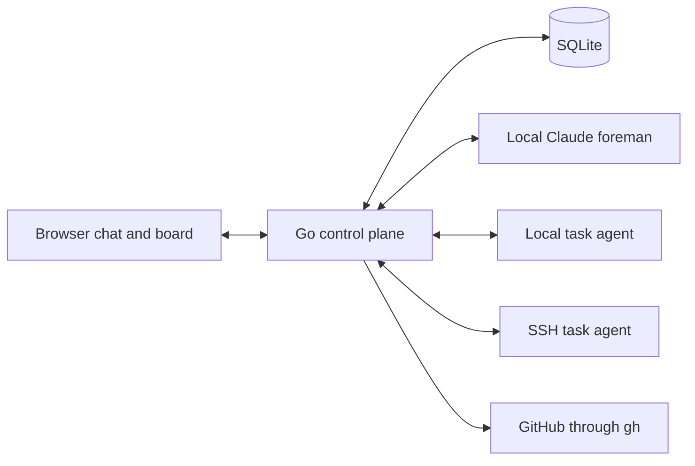

# Machinist architecture

## Executive summary

Machinist serves a browser factory and retains its existing batch execution path.
SQLite owns saved tasks, sessions, events, reports, and human decisions. TOML and
prompt files own operator configuration. One local foreman delegates coding tasks;
each task owns a branch, worktree, and continuing worker conversations.

The key rule is that agent completion cannot grant approval or mark a coding task
Done. Human decisions apply to exact saved versions. Verified merge of the approved
revision completes linked PR work. Interrupted execution is never replayed by a
batch lease scheduler.

### System architecture

```mermaid
flowchart LR
 Browser[Browser chat and board] <--> Server[Go control plane]
 Server <--> SQLite[(SQLite)]
 Server <--> Foreman[Local Claude foreman]
 Server <--> Local[Local task agent]
 Server <--> SSH[SSH task agent]
 Server --> GitHub[GitHub through gh]
```

### Dependency hierarchy

`internal/cli` starts `internal/controlplane`. The control plane mounts
`internal/factory`, which uses `internal/config` and the structured
`internal/agent` adapter. The adapter knows provider transport and permissions;
it does not decide task stages or approve work. Existing `internal/runner` and
`internal/managedworker` continue to own batch jobs.

## Factory request lifecycle

The browser reads configured projects and opens that project's saved foreman
conversation. Mutations require a same-origin CSRF token. An accepted message,
idempotency key, and transcript event are committed together before dispatch.
Factory turns serialize across conversations and hosts. The same conversation
rejects concurrent instructions rather than silently replaying them.

The foreman uses a stdio MCP bridge implemented by `machinist factory tools`.
Its short-lived bearer credential is scoped to the active conversation and
project. Server policy validates task creation, step starts, feedback, reports,
and cancellation. Human approval endpoints accept browser authority only.

Browser settings use one versioned SQLite record for resolved agents and pipelines.
A save validates the complete configuration and commits it before publishing it to
new work. Saved definitions override TOML seeds on restart. The browser cannot
change step order, types, or approval gates. Accepted foreman turns privately retain
their agent profile; recovery uses that original profile.

A new task snapshots profiles, prompt contents, steps, script arguments, and its
host/project identity. Its worktree is created before planning. Design approval
records the current content version before implementation becomes eligible.
Workers report structured results; terminal prose never determines task state.
Reports are persisted with a deduplication key and queued for the foreman at a
turn boundary. Script results are bound to the checked revision.

Code review currently uses a human fallback because the provider's plan mode does
not enforce read-only access. The browser shows the diff from the task's saved
base revision, check output, and approval controls. New revisions invalidate old
checks/review/approval. A read-only GitHub observer checks linked unfinished PRs
and never performs a merge.

## Conversation transport and recovery

`internal/agent` uses a pinned Claude ACP runtime over line-delimited JSON-RPC.
It initializes, creates or loads a provider session, selects mode/model, and
streams structured updates. Provider identity is persisted before prompt work.
Permission requests wait for browser decisions. Only Machinist's known scoped
tools are allowed by application policy without another prompt.

Local cancellation terminates the adapter process group. Remote execution uses a
configured SSH command and loopback reverse forwarding for its scoped MCP bridge.
Each remote workspace step stays on its configured host and uses that host's
credentials. A changed project/host definition cannot retarget a saved task.

Shutdown closes streams and cancels active execution. Restart marks unfinished
sessions interrupted. Resume requires explicit confirmation that the old process
stopped. The server does not infer remote process death from a disconnected SSH
stream. There is no automatic failover or worktree cleanup.

## Storage and trust

Factory records and ordered events use separate SQLite tables from batch jobs.
Task snapshots and provider IDs are private persisted fields; public state excludes
host-local paths and credentials. Events are paged and streamed with a cursor.
Slow browsers do not block agent execution. Agent output and script logs are bounded.

The browser server remains loopback-only. API scoping is not OS containment:
trusted agents can use host tools and credentials. A worktree does not isolate
shared Git configuration, network services, or credentials.

## Batch compatibility

`config.toml` still defines named commands, triggers, and server settings;
`worker.toml` defines permitted executors and repository paths. The runner owns
process supervision, artifacts, output, and timeouts. The control plane leases
batch attempts to managed workers and rejects stale completions. Factory attempts
never enter the batch lease tables.

Existing workflows retain ordered command steps, saved artifact snapshots, gates,
and explicit retry semantics. `agent.py` remains a legacy batch entry point and
does not schedule factory session repairs. Configurations without enabled factory
settings retain the existing UI and APIs. See [workflows](docs/workflows.md) and
[artifact storage](docs/artifacts.md).

## Source map and verification

- [Factory policy and records](internal/factory/): lifecycle, scoped tools, stream,
  recovery, revision checks, and GitHub observation.
- [Factory configuration](internal/config/factory.go): profile and pipeline validation.
- [Claude transport](internal/agent/): pinned adapter and opt-in live proof.
- [Browser factory](internal/controlplane/web/src/factory.jsx): chat, board,
  permission controls, task evidence, and human decisions.
- [Tool bridge](internal/cli/factory.go): stdio MCP to scoped HTTP operations.
- [Server boundary](internal/controlplane/server.go): loopback and browser auth.

Focused tests cover configuration gates, snapshots, message/report deduplication,
interrupted ownership, permissions, check retries, stale approvals, and verified
merge. The live adapter test checks streaming, conversation reload, denied writes,
and cancellation. Browser and remote acceptance evidence is recorded in the
implementation pull request. `just check` runs frontend checks, formatting,
Python tests, Go vet, race tests, and builds.
