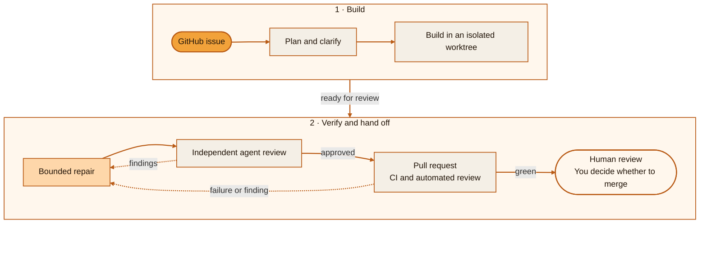
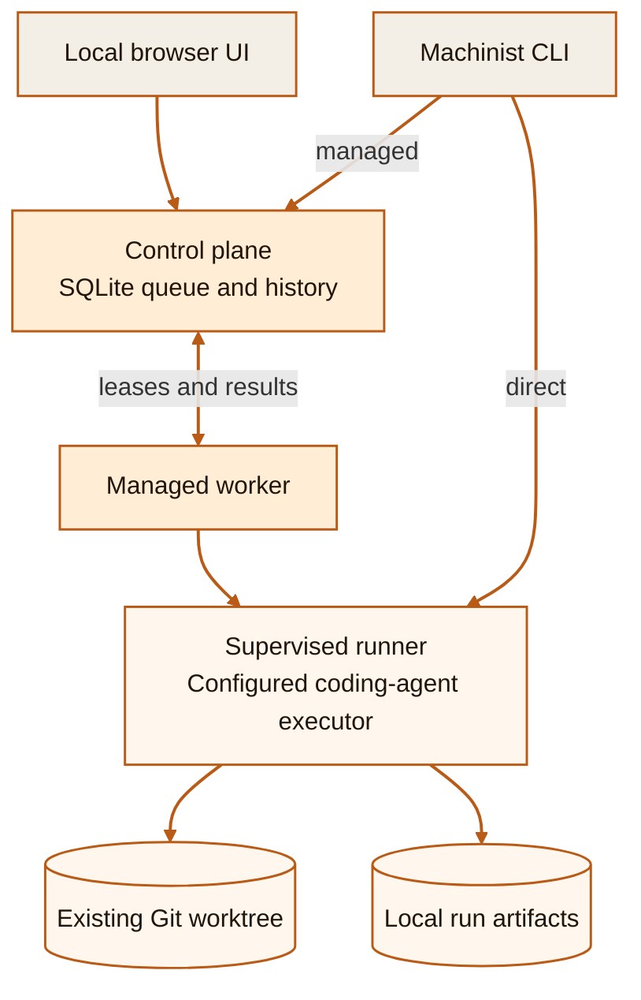

<div align="center">


# Machinist

**The open-source software factory for supervised coding agents.**

Turn a GitHub issue into a planned, implemented, independently reviewed, and
checked pull request, on your machine and under your control.

[](https://github.com/owainlewis/machinist/actions/workflows/ci.yml)
[](go.mod)
[](#project-status)
[](LICENSE)

[Getting started](docs/getting-started.md) · [How it works](docs/how-it-works.md) ·
[Architecture](ARCHITECTURE.md)

</div>

---

Machinist is a local runtime and control plane for running software development
as a repeatable production system. Give its `foreman` a GitHub issue. It plans
the work, dispatches fresh coding agents, requires an independent review, waits
for repository checks, and hands a verified pull request to you.

> **A software factory is more than an agent with shell access.** It combines a
> defined workflow, specialized workers, quality gates, durable evidence, and a
> clear human decision point. Machinist packages those parts into a system you
> can inspect, change, and version.

## The development flow

One request enters the factory. Planning, implementation, review, repair, and
CI form a supervised production line. The shipped foreman never merges the
result.



The loop is deliberately bounded. If the work cannot be made safe after the
allowed repair attempts, Machinist marks the issue as blocked and returns the
evidence instead of quietly continuing forever.

## What makes it a software factory?

| Factory capability | How Machinist provides it |
| --- | --- |
| **A defined process** | Agent prompts and pipelines are ordinary files that can be reviewed and versioned. |
| **Specialized workers** | A foreman coordinates fresh planning, building, reviewing, and repair agents. |
| **Quality gates** | Independent review and repository checks must pass before handoff. |
| **Repeatable execution** | The same runner supervises direct work and managed jobs. |
| **Traceability** | Ordered event logs, terminal results, job state, and run history record what happened. |
| **Explicit merge authority** | The shipped foreman always stops before merge. The separate Shepherd can merge only pull requests explicitly labelled `machinist:auto-merge`. |

The default `foreman` runs the issue-to-pull-request production line. Machinist
also ships a read-only `audit` agent that inspects a repository, independently
verifies possible bugs, and opens evidence-backed issues for the ones it can
prove. The separate `shepherd` agent can run on a managed schedule and serially
advance only pull requests carrying the `machinist:auto-merge` permission label.

## Inside the factory

Machinist separates portable workflow intent from machine-local authority. The
control plane can queue and track work, but it does not execute it. In direct
mode the CLI process resolves the executor command, repository path, process
environment, and credentials; in managed mode the worker does.



The shared `config.toml` supplies portable agents, prompts, and pipelines to the
CLI and control plane. Machine-local `worker.toml` settings supply executors,
model mappings, and the data directory to both execution paths. Named repository
mappings belong to managed workers; direct mode takes an existing Git worktree
path. This split keeps commands, paths, credentials, and artifacts with the
machine that performs the work.

## Why Machinist?

- **One request, a complete workflow.** The foreman coordinates planning,
  implementation, review, repair, and CI instead of stopping after one coding
  session.
- **Review before handoff.** A different agent reviews the exact change. Valid
  findings and failed checks return through a bounded repair loop.
- **Your tools and models.** Machinist launches configured executors such as
  Codex or Claude. Model aliases let each task select a model without embedding
  provider details in prompts.
- **Local by default.** Repositories, credentials, and executor commands remain
  on the worker. The control plane listens only on loopback.
- **Evidence, not guesswork.** Machinist records process outcomes, events,
  artifacts, duration, and reported token usage. It does not interpret an
  agent's prose as proof that the software is correct.

## Two ways to run the factory

| | Direct mode | Managed mode |
| --- | --- | --- |
| **Start with** | `machinist run` | Browser UI or `machinist submit` |
| **Best for** | One task, local experiments, existing scripts | Queued work, durable history, multiple workers |
| **Execution** | Starts immediately in the selected repository | A compatible worker leases and runs the job |
| **State** | Local run artifacts | SQLite job history plus local worker artifacts |
| **Server required** | No | Yes, on loopback by default |

Both modes use the same configuration, prompt rendering, process supervision,
and artifact format. Direct commands map process outcomes to CLI exit codes.
Managed submission returns after admission; the durable job records each later
run outcome.

## Quick start

You need macOS or Linux, Go 1.26.6 or newer, Git, an authenticated
[GitHub CLI](https://cli.github.com/), and an authenticated
[Codex CLI](https://developers.openai.com/codex/cli/). The shipped foreman uses
Codex and its native subagents.

### 1. Build and initialize

From a Machinist source checkout:

```sh
mkdir -p ./bin
go build -o ./bin/machinist ./cmd/machinist
./bin/machinist init
```

`machinist init` creates editable factory definitions and machine-local worker
settings under `~/.machinist`. Existing files are never overwritten.

### 2. Send an issue through the factory

```sh
./bin/machinist run \
  --agent=foreman \
  --repo=/absolute/path/to/your-repository \
  --prompt="Complete https://github.com/your-org/your-repo/issues/123"
```

Use a small, well-defined issue for the first run. Machinist streams the
agent's output and writes an ordered event log and terminal result under
`~/.machinist/worker/runs/`.

### 3. Review the finished pull request

The foreman leaves the issue and pull request ready for a person to review. It
does not merge.

To inspect a repository without changing it:

```sh
./bin/machinist run \
  --agent=audit \
  --repo=/absolute/path/to/your-repository \
  --prompt="Audit the request handling and persistence code"
```

To enable the optional scheduled merge queue, add a `[shepherd.<name>]` entry to
`config.toml` and create the `machinist:auto-merge` pull request label. See
[Configuration](docs/configuration.md#schedule-shepherd). Foreman remains unable to merge,
and Shepherd leaves every unlabelled pull request unchanged.

## Run the local control plane

When you want a queue, durable run history, and a browser UI, register a
repository in `~/.machinist/worker.toml`:

```toml
[repositories.my-project]
path = "/absolute/path/to/my-project"
```

Start the server and worker in separate terminals:

```sh
./bin/machinist start
```

```sh
./bin/machinist worker start
```

Open [http://127.0.0.1:7331](http://127.0.0.1:7331), choose a repository and
agent, and submit a work request.

You can submit the same managed work from the CLI. Use the repository name from
`worker.toml`, not its local path:

```sh
./bin/machinist submit \
  --agent=foreman \
  --prompt="Complete https://github.com/your-org/your-repo/issues/123" \
  --repo=my-project
```

## Design principles

1. **Intent is portable; authority stays local.** The control plane sends
   logical names and rendered prompts. Workers resolve commands, paths, and
   credentials.
2. **Execution facts are not product truth.** A successful process is recorded
   as a successful run, not interpreted as proof that a requested outcome is
   correct.
3. **Review is structurally independent.** The builder does not review its own
   work.
4. **Failure is visible and bounded.** Timeouts, cancellations, findings,
   failed checks, and exhausted repairs produce explicit outcomes.
5. **The human remains accountable.** The shipped foreman prepares and verifies
   a pull request, then stops. Its workflow leaves the merge decision to a
   person.

## Documentation

- [Getting started](docs/getting-started.md): requirements, installation, and
  first runs
- [How Machinist works](docs/how-it-works.md): direct runs, managed runs,
  supervision, and artifacts
- [Configuration](docs/configuration.md): agents, executors, models, prompts,
  and pipelines
- [Local control plane](docs/control-plane.md): server, workers, security, and
  failure recovery
- [Architecture](ARCHITECTURE.md): components, dependency direction, execution
  flows, trust boundaries, and persistence
- [Development](docs/development.md): build, test, and project layout
- [Migration from Factory](docs/migration-from-factory.md): renamed interfaces,
  clean installation, and rollback

## Project status

Machinist is early software for trusted local automation on macOS and Linux.
The control plane intentionally accepts only loopback listeners. Remote
deployment needs a separate authenticated web surface and TLS boundary.

Prompt rules define the shipped agents' behavior, including the instruction not
to merge. Operating-system permissions, repository permissions, and credential
scope enforce their actual capabilities. Review the prompts and executor
commands before use.

The opt-in Python evaluation suite under [`evals/`](evals/) exercises the
complete default workflow against a dedicated scratch repository. It is
separate from `just check` because it creates real GitHub issues and pull
requests.

## License

[MIT](LICENSE)
