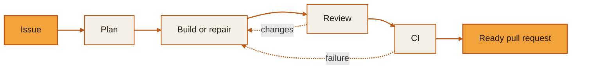
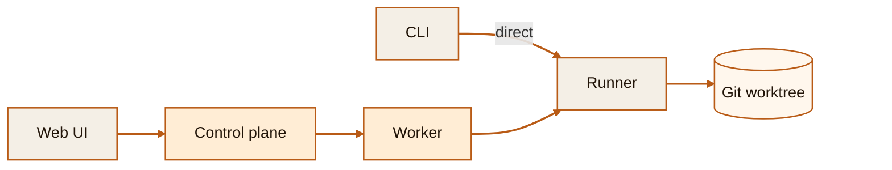

<div align="center">


# Machinist

**A software factory for coding agents.**

Machinist turns a GitHub issue into a reviewed pull request. It runs on your
machine, uses coding agents you configure, and leaves the merge decision to you.

[](https://github.com/owainlewis/machinist/actions/workflows/ci.yml)
[](go.mod)
[](#project-status)
[](LICENSE)

[Getting started](docs/getting-started.md) · [How it works](docs/how-it-works.md) ·
[Architecture](ARCHITECTURE.md)

</div>

---

## Why call it a software factory?

Machinist runs a fixed development process instead of one long agent session.
The default `foreman` plans the issue, gives the work to fresh agents, asks a
different agent to review it, waits for CI, and opens a pull request.



Review and CI failures go back for repair. The retry limit stops a broken task
from running forever. Machinist records what happened and stops after preparing
the pull request. It never merges it.

## Quick start

You need macOS or Linux, Go 1.26.6 or newer, Git, an authenticated
[GitHub CLI](https://cli.github.com/), and an authenticated
[Codex CLI](https://developers.openai.com/codex/cli/).

Build Machinist and create the default config:

```sh
mkdir -p ./bin
go build -o ./bin/machinist ./cmd/machinist
./bin/machinist init
```

`machinist init` writes editable agent and worker settings to `~/.machinist`.
It does not overwrite existing files.

Run the foreman against a small, well-defined issue:

```sh
./bin/machinist run \
  --agent=foreman \
  --repo=/absolute/path/to/your-repository \
  --prompt="Complete https://github.com/your-org/your-repo/issues/123"
```

Machinist streams the agent output and writes the run log and result under
`~/.machinist/worker/runs/`.

## Direct and managed runs

`machinist run` starts work immediately. It is the simplest way to try the
project. Managed mode adds a local queue, run history, browser UI, and workers.

| | Direct | Managed |
| --- | --- | --- |
| Start with | `machinist run` | Browser UI or `machinist submit` |
| Repository | Existing Git worktree path | Name from `worker.toml` |
| State | Local run files | SQLite history and local run files |
| Server | Not needed | Runs on loopback |

Both modes use the same agents, prompts, runner, and file format.

## How the parts fit together



In a direct run, the CLI starts the runner. In a managed run, the control plane
queues the job and a worker starts the runner. The runner launches the configured
coding agent in an existing Git worktree and saves the run files locally.

Shared settings live in `~/.machinist/config.toml`. Machine-specific executor,
model, path, and worker settings live in `~/.machinist/worker.toml`.

## Run the local control plane

Add a repository to `~/.machinist/worker.toml`:

```toml
[repositories.my-project]
path = "/absolute/path/to/my-project"
```

Start the server and worker in separate terminals:

```sh
./bin/machinist start
```

```sh
./bin/machinist worker start
```

Open [http://127.0.0.1:7331](http://127.0.0.1:7331) to submit work, or use the
CLI:

```sh
./bin/machinist submit \
  --agent=foreman \
  --prompt="Complete https://github.com/your-org/your-repo/issues/123" \
  --repo=my-project
```

## Audit a repository

The read-only `audit` agent looks for bugs and opens an issue only when it can
show evidence:

```sh
./bin/machinist run \
  --agent=audit \
  --repo=/absolute/path/to/your-repository \
  --prompt="Audit the request handling and persistence code"
```

## Documentation

- [Getting started](docs/getting-started.md)
- [How Machinist works](docs/how-it-works.md)
- [Configuration](docs/configuration.md)
- [Local control plane](docs/control-plane.md)
- [Architecture](ARCHITECTURE.md)
- [Development](docs/development.md)
- [Migration from Factory](docs/migration-from-factory.md)

## Project status

Machinist is early software for trusted local use on macOS and Linux. The
control plane only listens on loopback. Do not expose it directly to a network.

The no-merge rule is an agent instruction, not a security boundary. Use
operating-system and GitHub permissions to limit what agents can do, and review
your prompts and executor commands before running them.

The optional Python suite under [`evals/`](evals/) tests the full workflow in a
scratch GitHub repository. It is separate from `just check` because it creates
real issues and pull requests.

## License

[MIT](LICENSE)
