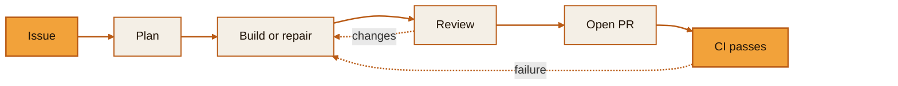
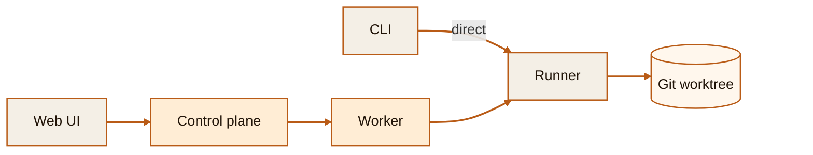

<div align="center">


# Machinist

**Build your own software factory.**

Machinist is an open-source software factory implementation for coding agents.
It runs development workflows you define, on your machine and against your
repositories.

Start with the included issue-to-pull-request factory, or create your own agents
and pipelines. You control the prompts, models, executors, timeouts,
repositories, and order of work.

[](https://github.com/owainlewis/machinist/actions/workflows/ci.yml)
[](go.mod)
[](#project-status)
[](LICENSE)

[Getting started](docs/getting-started.md) · [How it works](docs/how-it-works.md) ·
[Architecture](ARCHITECTURE.md)

</div>

---

## Predictable development with agents

Machinist turns agent work into a process you can run again. Define the stages
once, then use the same planning, building, testing, and review steps for every
task. This makes the work more consistent and gives you clear places to add
quality gates.

Each run produces logs and a final result. If an agent or pipeline step fails,
Machinist stops instead of carrying on with a broken result.

## Included issue-to-pull-request factory

The default `foreman` plans a GitHub issue, gives implementation and review to
fresh agents, opens a pull request, and waits for repository CI. Review or CI
failures go back for repair until review and automation pass. Repair attempts are
numbered and preserved across resumed work. The foreman does not merge the pull
request.



## Customise the factory

The factory is configuration, not hard-coded behavior. Agent prompt files define
what each agent does. `config.toml` defines agents and ordered pipelines.
`worker.toml` maps executors, model names, repositories, and local paths.

You can use Codex, Claude, or another command-line coding agent. You can run one
agent, chain several agents into a pipeline, or write a supervising agent like
the included foreman. See [Configuration](docs/configuration.md) to create your
own factory.

## Quick start

You need macOS or Linux, Go 1.26.6 or newer, Git, an authenticated
[GitHub CLI](https://cli.github.com/), and an authenticated
[Codex CLI](https://developers.openai.com/codex/cli/) with native subagents
enabled.

Build Machinist and create the default config:

```sh
mkdir -p ./bin
go build -o ./bin/machinist ./cmd/machinist
./bin/machinist init
```

`machinist init` writes editable agent and worker settings to `~/.machinist`.
It does not overwrite existing files.

Run the foreman against a small, well-defined issue:

```sh
./bin/machinist run \
  --agent=foreman \
  --repo=/absolute/path/to/your-repository \
  --prompt="Complete https://github.com/your-org/your-repo/issues/123"
```

Machinist streams the agent output and writes the run log and result under
`~/.machinist/worker/runs/`.

## Direct and managed runs

`machinist run` starts work immediately. It is the simplest way to try the
project. Managed mode adds a local queue, run history, browser UI, and workers.

| | Direct | Managed |
| --- | --- | --- |
| Start with | `machinist run` | Browser UI or `machinist submit` |
| Repository | Existing Git worktree path | Name from `worker.toml` |
| State | Local run files | SQLite history and local run files |
| Server | Not needed | Runs on loopback |

Both modes use the same agents, prompts, runner, and file format.

## How the parts fit together



In a direct run, the CLI starts the runner. In a managed run, the control plane
queues the job and a worker starts the runner. The runner launches the configured
coding agent in an existing Git worktree and saves the run files locally.

Shared settings live in `~/.machinist/config.toml`. Machine-specific executor,
model, path, and worker settings live in `~/.machinist/worker.toml`.

To enable the optional scheduled merge queue, add a `[shepherd.<name>]` entry to
`config.toml`. Shepherd ensures the repository defines the `machinist:auto-merge`
label and advances only pull requests carrying it. See
[Configuration](docs/configuration.md#schedule-shepherd). Foreman remains unable
to merge, and Shepherd leaves every unlabelled pull request unchanged.

## Run the local control plane

Add a repository to `~/.machinist/worker.toml`:

```toml
[repositories.my-project]
path = "/absolute/path/to/my-project"
```

Start the server and worker in separate terminals:

```sh
./bin/machinist start
```

```sh
./bin/machinist worker start
```

Open [http://127.0.0.1:7331](http://127.0.0.1:7331) to submit work, or use the
CLI:

```sh
./bin/machinist submit \
  --agent=foreman \
  --prompt="Complete https://github.com/your-org/your-repo/issues/123" \
  --repo=my-project
```

## Audit a repository

The read-only `audit` agent looks for bugs and opens an issue only when it can
show evidence:

```sh
./bin/machinist run \
  --agent=audit \
  --repo=/absolute/path/to/your-repository \
  --prompt="Audit the request handling and persistence code"
```

## Use Machinist from a coding agent

Install the portable Machinist skill for Claude Code, Codex, or another
supported coding agent:

```sh
npx skills add owainlewis/machinist --skill machinist
```

The skill teaches an agent how to create and assign Machinist tasks, interpret
lifecycle labels, resume work, and hand a verified pull request to a person.

## Documentation

- [Getting started](docs/getting-started.md)
- [How Machinist works](docs/how-it-works.md)
- [Configuration](docs/configuration.md)
- [Local control plane](docs/control-plane.md)
- [Architecture](ARCHITECTURE.md)
- [Development](docs/development.md)
- [Migration from Factory](docs/migration-from-factory.md)

## Project status

Machinist is early software for trusted local use on macOS and Linux. The
control plane only listens on loopback. Do not expose it directly to a network.

The no-merge rule is an agent instruction, not a security boundary. Use
operating-system and GitHub permissions to limit what agents can do, and review
your prompts and executor commands before running them.

The optional Python suite under [`evals/`](evals/) tests the full workflow in a
scratch GitHub repository. It is separate from `just check` because it creates
real issues and pull requests.

## License

[MIT](LICENSE)
