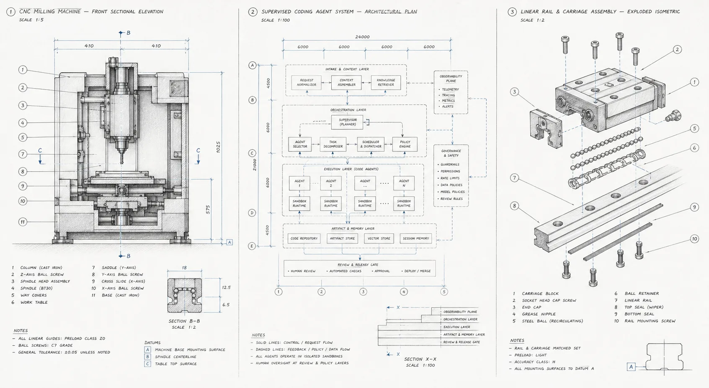

<p align="center">
  
</p>

<p align="center">
  <strong>The open source AI software factory for agentic coders.</strong><br>
 Machinist is an open source software factory for repeatable and scalable AI coding workflows. 
</p>

<p align="center">
  <a href="https://machinist.sh">Website</a> ·
  <a href="docs/README.md">Documentation</a> ·
  <a href="docs/configuration.md">Configuration</a> ·
  <a href="examples/workflows/README.md">Workflow examples</a>
</p>

<p align="center">
  
</p>

<p align="center"><sub>Machine section · supervised agent system · exploded assembly</sub></p>

Machinist is a browser-based software factory. Talk to one local foreman, let it
coordinate task agents on local or SSH-connected hosts, and inspect the work on a
Design, Build, Review, Done board. Agents and pipeline steps are configuration.

This is early access software. The factory currently supports Claude Code for
live conversations and human code review. Existing batch executors remain
available for other agent CLIs and scripts.

## Start with the browser factory

Follow the [factory setup guide](docs/factory.md) to install the structured Claude
adapter, enable the example configuration, and start Machinist. Submit tasks,
answer questions, inspect diffs, and approve work in the browser. A turn ending
does not mark a coding task Done; a linked approved revision must be merged.

## Existing batch workflows

The CLI and managed worker APIs remain supported for configured batch commands.
[Initialize Machinist](docs/configuration.md), then run a named command directly
or follow [the task workflow guide](docs/task-guide.md).

## How execution works

For a direct run, Machinist maps the configured command name to a fixed executable and uses the path supplied with `--repo` as the working directory. Managed submissions instead resolve an approved repository name from the worker configuration. In both cases, Machinist renders the prompt, sends it on standard input, streams stdout and stderr, and applies one overall timeout and cancellation. Exit code 0 succeeds; every non-zero exit code fails.

Inside each command, scripts are intentionally opaque. Their internal stages appear in logs, but Machinist does not infer their internal stages. A killed script restarts from the beginning unless the script owns checkpointing.

For explicit steps, [configure a workflow](docs/workflows.md):

```toml
[workflows.deliver]
steps = ["task-to-pr"]
```

Workflow tasks retain results and saved files, support approval and feedback, and keep earlier attempts in history. Each stage can read and write `{{task.output_dir}}`; Machinist restores and saves the shared folder between stages.

Start with [your first task workflow](docs/task-guide.md): create a task from an issue or spec, follow it on the board, and review the result. The [classify-then-merge example](examples/workflows/risk_delivery/README.md) adds independent risk assessment and a conservative merge policy.

## Go deeper

| Guide | What it covers |
| --- | --- |
| [Documentation](docs/README.md) | Choose the right setup and operations guide |
| [Browser factory](docs/factory.md) | Foreman chat, task agents, review, and remote setup |
| [Task workflow guide](docs/task-guide.md) | Set up planning, approval, shared files, and build |
| [Configuration](docs/configuration.md) | Commands, executors, workers, models, and repositories |
| [Development](docs/development.md) | Build, test, and work on Machinist locally |
| [VM deployment](docs/vm-deployment.md) | Run the control plane and worker as services |
| [Workflow examples](examples/workflows/README.md) | Prompt-driven and scripted workflows |

## Contributing

Read [CONTRIBUTING.md](CONTRIBUTING.md) for development setup and pull-request expectations. Security issues should follow [SECURITY.md](SECURITY.md).

Machinist is released under the [MIT License](LICENSE).
