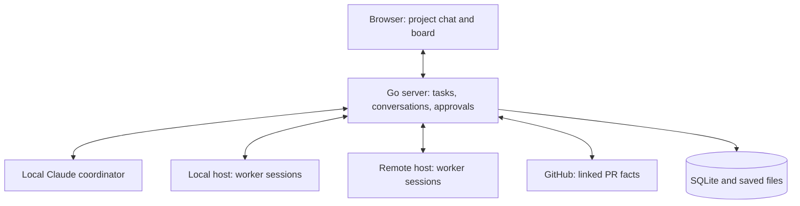

# A software factory with one local foreman

> Status: Proposed. This document defines the target and recommended defaults. The accompanying [implementation plan](plan.md) is a proposed delivery sequence, not approval to implement it.

## 1. Executive summary

Machinist currently exposes commands, workflow steps, and execution results. Owain wants to talk to one local foreman that manages a software factory, with configurable specialist agents on local or remote machines and work moving through Design, Build, Review, and Done. The product should make that loop easy to understand and keep its code small.

Keep the Go server, SQLite storage, configured execution, worker connections, and saved files. Add persistent conversations, task ownership, and a small typed pipeline with agent, script, and approval steps. Make project chat and the board the primary interface. Limit the first interactive integration to Claude Code. The principal cost is managing conversation lifetime, permissions, and recovery instead of treating each process exit as the end of the work.

## 2. Context and scope

Verified against Machinist commit `3943516` and Agent Orchestrator commit `a2a8917c22e2246bf63b98e06a97c417f3b3fb76` on 3 October 2026.

Current [architecture](../../ARCHITECTURE.md): the runner executes configured processes; the control plane leases jobs to workers; workflow jobs advance through an ordered list of commands. The managed worker uploads recorded output after execution. Feedback starts another attempt. Machinist does not own continuing agent conversations or automatically create task worktrees.

The current UI offers runs, commands, workflows, triggers, workers, and analytics. Its Finished column means the run completed or stopped, not that its code was accepted. `agent.py` also implements an issue delivery and repair loop. These are existing features, not requirements for the new primary experience.

Target: one local factory foreman with saved project conversations, task-owned worker conversations, local and remote execution, live updates, explicit design/review decisions, and a four-column board. Generic batch commands remain available during migration but do not determine the new task lifecycle.

## 3. System context

The foreman is the coordinator agent and the only agent the user talks to. The terms describe the same role, not two components. A factory is the application instance that owns its projects, reusable agent definitions, workflows, and work. Start with one factory and one local foreman; each project has a saved conversation with that foreman, not a separately configurable coordinator fleet. A host is a machine connection that runs agents. A session is one agent conversation and its workspace. A task is the requested outcome, independent of session or execution lifetime. A turn is one accepted instruction and its response.

The foreman uses a single factory-level profile and is local to the server in the first version. Remote hosts connect through an authenticated private tunnel. The browser talks only to the server. Agent credentials and repository paths remain on the host that uses them.

## 4. Proposed design

### How it works

Owain chooses a project and describes a feature in coordinator chat. The foreman can read project context, ask questions, select a configured workflow, and create a Design task. The task snapshots that workflow and its referenced definitions. A configured planning agent writes the design and acceptance criteria. Questions from that agent return through the foreman. A human approval records the exact design version.

The coordinator starts a builder session in a task-owned worktree. Machinist records ownership before dispatch. The host streams messages and activity while the coordinator receives concise milestones, blockers, and final reports. A worker turn ending leaves its session available for feedback.

A configured script runs the build checks after the implementation agent finishes. A passing script result and submitted revision make the task eligible for Review. A separate reviewer inspects that revision. Findings return the task to Build and are sent to its builder. A new code revision invalidates the old review and approval. Once review passes, the human approves delivery. For the initial coding workflow, a verified merge moves the task to Done. Closing a PR without merge does not count as delivery.

### Components and responsibilities

- Project service owns project identity, repository identity, and coordinator configuration. Hosts own local repository paths and installed executables.
- Task service owns the requested outcome, design version, stage, assignments, and decisions. It does not infer delivery from process exit.
- Conversation service owns turns, saved messages, pending interactions, and provider conversation identity. It does not plan work or implement changes.
- Host session controller owns agent process lifetime and workspace creation. The existing runner continues to own bounded batch process execution.
- Agent adapters translate provider protocols into common events and operations. They do not own task transitions or GitHub policy.
- Foreman uses Machinist tools to select configured pipelines, assign work, inspect results, and request permitted corrections. Specialist questions and human feedback pass through the foreman. It cannot change the running task definition or skip approval steps. It delegates implementation and has no authority to grant approvals through its Machinist session credentials.
- Review service records verdicts against a specific revision. GitHub observation records PR facts without starting its own repair loop. The small pipeline controller validates the current step and records attempts; it does not independently decide which work to spawn.
- Browser presents stored facts and decisions. It does not contain workflow policy.

### Agents and pipeline steps

A reusable agent definition is a stable ID, name, description, prompt, runtime/executor reference, optional model, timeout, and host preference. Ship foreman, planning, implementation, and review defaults. Users can customize each specialist independently; multiple definitions may use the same supported runtime. Do not imply every executable supports interactive conversation.

A workflow is an ordered list of steps. Each step has a stable ID, display name, board stage (Design, Build, or Review), timeout where applicable, and exactly one type:

| Type | Configuration | Result |
| --- | --- | --- |
| Agent | Agent definition ID and task inputs | Structured output plus continuing stage-agent conversation |
| Script | Approved command ID and task inputs | Exit status, bounded output, and optional validated result file |
| Approval | Design or code review subject | Authenticated human approval or request for changes |

Example default: planning agent (Design) → design approval (Design) → implementation agent (Build) → check script (Build) → review agent (Review) → code approval (Review) → wait for verified merge (Review) → Done. Merge observation is a delivery condition, not a fourth executable step type.

There is one task workspace shared over time by its planning and implementation stages. The reviewer uses an isolated read-only view of the submitted commit. Each agent step has its own conversation, reused on correction. Scripts run in the owned workspace through the existing runner. Later steps read task artifacts through the existing saved-file contract; the host-local worktree remains the source of code.

The foreman chooses a registered workflow and requests execution of the current eligible step. The server checks order, capability, ownership, and approvals before dispatch. A successful step records completion and exposes the next eligible step to the foreman. It does not also auto-spawn through the legacy workflow scheduler. This makes the foreman the routing authority and the pipeline the execution/approval authority, with no competing repair loops.

Keep the first routing rules small: ordered forward progression; approval feedback to the step whose output it reviews; and review/check feedback to the implementation step. A rebuild must run its checks, independent review, and code approval again. Bound repair passes to three per task and pause for a human decision at the limit. No arbitrary graph, expressions, nested workflows, automatic skip, or agent-authored shell commands. A shorter task uses an explicitly selected registered workflow; required code review and delivery checks remain server-enforced. The default workflow always requires design approval.

Agents are configuration, not a new service or database registry. Extend the existing TOML configuration with named agent profiles and ordered pipeline steps; keep long prompts in referenced text files. Reuse command IDs for scripts. Validate references on load and snapshot the resolved configuration when a task starts. Configuration changes apply to new tasks only. Start with one default pipeline and supported runtime. Do not build agent CRUD, workflow editing, import/export, or a graph canvas in the first release. Basic prompt/model editing can later write the same configuration if actual use calls for it.

### Browser experience

The daily coding loop must work entirely in the browser. Setup may require installing and authenticating a local runtime, but submitting work, answering questions, inspecting changes, and giving approval must not require a terminal.

Use a compact project sidebar and one dominant foreman chat. The project has Chat and Board views with shared task context. Keep the composer visible and use it to describe outcomes. Board cards show title, stage, current activity, and any action needed. Do not turn raw tool output into the main conversation.

Selecting a card opens a task detail panel with the brief, design, changed files, diff, checks, review result, and pending approval. Show the reason and relevant evidence beside each approval button. Worker transcripts are available for inspection; follow-up goes through the foreman with the task attached. Keep routine activity collapsed. Interrupted work shows one clear Resume or Cancel action. On small screens, show one view at a time and preserve navigation back to chat.

Settings contains host/runtime connection status and a read-only summary of the configured agents and pipeline. Legacy runs stay in History. Do not put Agents, Commands, Workers, Triggers, Analytics, and Workflows beside the daily work as equal destinations. Browser code inspection and review are in scope; a full code editor, terminal emulator, and general IDE are later decisions.

### Decisions

Select one execution host per task before planning. Create the task workspace before the first planning turn; design approval gates implementation, not workspace creation. All steps using that workspace run on the selected host. Reject incompatible stage host preferences rather than transferring a live workspace between machines. A reviewer receives a separate read-only view of the submitted revision.

Use Claude Code through a maintained structured adapter for initial chat, subject to the protocol proof in plan task 1. AO uses `claude-agent-acp` around the installed Claude executable. Confirm streaming, permission handling, cancellation, and conversation reload against the installed version before committing to that integration. Do not parse terminal prose to determine state.

Expose coordinator operations through a thin CLI over server APIs. This fits Machinist's existing `submit` entrypoint and agents' shell access. An MCP tool server is deferred because it would add another delivery surface. Use machine-readable JSON replies and stable IDs.

Keep durable task stages explicit, with server-validated transitions. Unlike AO's delivery board, Design is a product decision and cannot be derived solely from PR facts. Derive badges such as Working, Needs you, Disconnected, and Checks failed from activity and observations. Do not allow free-form status strings from agents to decide the board.

Start with one implementation agent session per task and one PR per task. Planning, implementation, and review are separate configured roles. A coordinator can manage multiple tasks; parallel execution is enabled only after workspace isolation. Begin with one active agent turn per host, matching current managed execution. Queue extra turns and show their position. Increase concurrency only with measured evidence.

Restart recovery preserves conversation IDs and workspaces but does not promise survival of running tool calls. In the first version a host or server restart interrupts active turns. Explicit Resume loads the provider conversation and starts a new turn after the old process is confirmed stopped. Detached agent hosts and automatic replay are deferred.

## 5. Invariants and requirements

- INV-1: One factory foreman profile supplies at most one active conversation per project. The user communicates with specialist agents through that foreman.
- INV-2: Every worker session belongs to one task and one host. Its workspace remains stable across follow-up turns.
- INV-3: Each active turn has one owner generation. Stale messages and completions cannot change current state.
- INV-4: Accepting the same request ID twice creates one task, turn, report, or decision.
- INV-5: Process exit and agent reports do not prove review approval or delivery.
- INV-6: Human approval names the current design version or code revision. Old approvals cannot authorize new content.
- INV-7: A permission request pauses execution until an authenticated human decision. Coordinator session credentials cannot approve it through Machinist.
- INV-8: Dirty workspaces are never automatically deleted. Cancellation does not delete outputs or history.
- INV-9: Disconnection never creates a replacement execution while the old owner may still be running.
- INV-10: One component, the task/coordinator loop, owns requests for coding repairs in the new flow.
- INV-11: A reviewer cannot edit the builder workspace. A review-only instruction is not a containment boundary.
- INV-12: A task runs its snapshotted agent/script/approval definitions; configuration edits cannot change a live task or its retries.
- INV-13: The foreman can request eligible execution but cannot bypass step order, required checks, or approval gates.

Requirements: one factory foreman with project conversations; configurable stage agents, scripts, and approvals; local Claude chat; local or remote workers; saved conversations; live output; explicit approvals; stable task cards; readable failure states; existing history preserved during migration.

## 6. Interfaces and data

### Naming and identity

Reuse current generated opaque ID conventions. Names are editable labels, not identifiers. A project has a stable ID and logical repository identity. Each host maps that identity to a local checkout. Renaming a host or project cannot retarget existing sessions. Existing jobs keep their IDs. No task is silently inferred from an ambiguous log or PR URL in prose.

### Stored records

Keep the factory foreman profile, agent profiles, and typed pipeline in the existing configuration. Store projects, tasks, sessions, turns, ordered session events, reports, task decisions, and linked PR facts. Snapshot resolved workflow and agent definitions, prompt contents, and approved script command definitions or hashes when accepting each new task. Reject execution if the host resolves a different command definition. Host-local repository paths and credentials remain outside snapshots. Record step ID, snapshot version, current attempt, and feedback target using existing run history. A task stores project, title, brief, approved design reference/version, stage, lifecycle, builder/reviewer assignments, and delivery revision. Lifecycle is active, cancelled, or archived, separate from its four-column stage.

A session stores role, task/project owner, host, adapter, provider conversation ID, workspace and branch, controller generation, and activity. Keep existing run records as execution attempts underneath sessions rather than creating another attempt ledger. Add an explicit batch/session execution mode. Every legacy claim, lease-reclaim, retry, and completion path must exclude session-owned runs. An expired session lease marks the attempt interrupted; it never requeues it. Test this before worker delegation. Store saved files through the existing artifact mechanism.

Pending tool approvals store provider request ID, session generation, description, and status. A report stores its source session/turn, kind, summary, outputs, and delivery acknowledgement. Reviews store the task, commit ID, verdict, findings, and reviewer identity.

### Proposed API surface

Names describe contracts; implementation should follow existing router conventions.

| Operation | Contract |
| --- | --- |
| Create/list projects and tasks | Stable IDs; mutations require authentication and request IDs. |
| Open coordinator | Return existing active session, or create exactly one. |
| Send session message | Persist an accepted turn before dispatch; return its ID. |
| Cancel turn/session | Request stop; distinguish stop requested from confirmed stopped. |
| Read conversation/events | Bounded pages and ordered event cursor. |
| Report milestone/result | Validate session ownership; persist once; enqueue coordinator context. |
| Approve design/revision | Compare expected version and stage atomically; reject stale decisions. |
| Request changes | Persist feedback and target builder turn once. |
| Host exchange | Deliver pending commands and accept events/completions under current ownership. |

CLI additions cover project/task list and inspect, task creation, session send, report, and cancellation. Existing submit remains a batch command. Do not add a generic CLI command that writes arbitrary task state.

### Streaming and reports

Normalize message delta, activity start/end, permission requested/resolved, turn completed/failed, and error events. Keep provider-specific payloads in adapters. Append events with host sequence and generation, acknowledge persisted batches, and replay unacknowledged batches. The browser uses SSE for updates and reconnects from its event cursor; slow clients read history rather than blocking execution.

Reports wake the coordinator only for completion, a blocker, or a human decision. Ordinary activity remains visible without consuming coordinator turns. Queue reports while the coordinator is busy. Deliver them at its next turn boundary; do not interrupt a human exchange to narrate routine progress. Duplicate report IDs produce no extra turn. Describe reports as claims and retain verification evidence separately.

### Compatibility

Use additive schema migrations. Existing jobs, workflows, artifacts, and links remain accessible under a secondary execution-history view. Do not mark old successful runs Done or start an agent to convert them. New project tasks use the session path; legacy jobs use their original path. Record which mode owns a task and never run both controllers on it.

## 7. Failure behavior and lifecycle

- Browser disconnect: agents continue. Reconnect replays stored events. A failed status read shows last successful update time.
- Provider failure: mark the turn failed, retain history/workspace, and offer Resume. If native history cannot load, explain that before creating a replacement conversation.
- Server restart: reconcile active ownership, mark uncertain turns interrupted, and require confirmed stop before Resume. No automatic coding replay.
- Host disconnect: mark disconnected after three missed ten-second heartbeats. Keep its work assignment. On reconnect reconcile the same generation and pending commands; do not move it to another host automatically.
- Cancellation: connected hosts receive stop within the next ten-second exchange. Keep Stop requested until confirmation. During a partition no finite stop time is promised.
- Permission request: record and display Needs you. Restart invalidates requests from the retired generation rather than approving them.
- GitHub failure: retain last-known facts with a stale badge. Back off failed observation and keep local chat usable.
- Lost response after submission: retry with the same request ID. The server returns the original accepted object.
- Two human decisions race: one comparison succeeds; the other receives a conflict and reloads current state.
- Definition edits: affect new tasks only, including script references and agent models. Deleted definitions referenced by active tasks remain available through their snapshots. Configuration changes: affect new sessions. Changing an active session's provider or host requires explicit replacement after stopping it.
- Shutdown: stop accepting turns, request agent termination, wait up to ten seconds, terminate remaining local process trees, and mark unfinished turns interrupted. Hosts follow the same sequence.

## 8. Security, privacy, and operations

Keep browser access on loopback. Remote hosts use the existing token boundary through a private SSH tunnel or equivalent authenticated transport; do not expose the current UI publicly. Add per-host revocable credentials before remote session support. A host credential can read its assigned work and publish its own events, not approve reviews or operate another host.

Foreman CLI credentials are conversation-scoped and project-scoped. Agent and pipeline configuration is operator-managed; foreman tools cannot edit it. Permit task creation, inspection, messages, and reports. Exclude human approval, merge, destructive cleanup, and arbitrary machine paths. Enforce these restrictions in Machinist APIs, including human-decision endpoints; coordinator credentials cannot use browser human-decision authentication. This is an API authority boundary, not containment of the local Claude process. A local agent with shell access may reach existing Git/GitHub credentials or another host service. The first release treats that process as trusted, keeps explicit no-publish/no-merge instructions, and does not claim to prevent direct host operations. OS-level containment and credential brokering require a separate design before running untrusted agents. Prove API denial without presenting it as proof of host containment.

Use logical repository names in requests. Validate saved file paths and retain existing artifact limits. Keep credentials, logs, conversations, and databases outside the source checkout. Escape displayed output and never execute markup received from an agent.

The initial reviewer must have tested provider-enforced read-only execution and no write access to the builder workspace. If this cannot be proved, use human review until contained review is available.

Defaults: one active turn per host; maximum four unfinished implementation tasks per project; at most 100 queued messages per session; reject oversized incoming events above 256 KiB; host batches at most 64 events/1 MiB; browser pages at most 100 events. Flush host events at least once per second while connected. Save event logs with a 32 MiB budget per turn, emit an explicit truncation event, and preserve final status/report delivery separately. The host continues draining process output even when recording stops. These are initial bounded defaults, not scale claims.

Task completion does not initiate merge. Merge remains an explicit human action or user-authorized tool operation. Poll only linked open PRs, starting with a 30-second non-overlapping interval. Checks and reviews always refer to a commit; a new commit invalidates readiness.

## 9. Acceptance criteria

- AC-1: A user chats with local Claude, receives live text/activity, reloads the browser, and sees the saved conversation without creating another session.
- AC-2: The coordinator creates a task and starts a builder through Machinist, with a visible card and isolated worktree.
- AC-3: The same worker conversation accepts a correction after its first turn completes.
- AC-4: Worker completion/blocker reports reach the coordinator once, including across a lost response and reconnect.
- AC-5: Two approved local tasks have different branches/workspaces and cannot share a live controller.
- AC-6: A remote host runs a task using its own checkout and credentials and streams events to the same browser view.
- AC-7: The task passes Design, Build, Review, Done; a rejected review returns it to Build; stale approval is rejected.
- AC-8: Permission requests pause execution; coordinator session credentials are rejected by Machinist approval and merge APIs. Direct host operations remain the documented trusted-agent limitation.
- AC-9: Restart or disconnection does not start duplicate coding work. Explicit recovery preserves the assigned workspace and shows interruption.
- AC-10: A completed agent turn, failed run, or closed unmerged PR never alone makes a coding task Done.
- AC-11: The primary UI has projects, foreman chat, board, and task detail. Settings shows the configured agents and pipeline; host setup and old history remain under Settings/history.
- AC-12: Existing configuration and stored execution history remain readable without silently starting or publishing work.
- AC-13: A user changes a planning/build/review agent prompt and supported runtime/model, or edits an ordered agent/script/approval workflow; only new tasks use the edit.
- AC-15: A user submits a real coding task, answers a worker question through the foreman, inspects the design and code diff, requests a correction, and approves delivery entirely in the browser.
- AC-14: A script failure stops forward progression; approvals cannot be skipped; correction reruns checks/review/approval; the third unsuccessful repair pauses for human input.

## 10. Test approach

Use a fake adapter for deterministic turn, event, permission, cancellation, and reconnect tests. Use a fake host and fake GitHub client for ownership and delivery tests. Prove INV-1 through INV-13 at the API/store boundaries, including duplicated and reordered events.

Live provider proof establishes AC-1, AC-3, and AC-8. A fixture Git repository establishes AC-2, AC-5, AC-7, and AC-10. A second host through SSH proves AC-6 and AC-9. Real browser checks prove AC-1, AC-7, AC-11, and AC-15. Migration fixtures prove AC-12. Definition snapshots and mixed-step lifecycle tests prove AC-13 and AC-14, including edits during active work and incorrect host capabilities. Duplicate report and busy-coordinator tests prove AC-4. Never substitute a fake provider for the live integration acceptance check.

Run focused Go and frontend tests per implementation task; use the repository's complete `just check` gate before delivery. Live checks use a disposable project and explicit authority; no automated test publishes or merges production work.

## 11. Risks and tradeoffs

Conversation reload may vary by adapter version. Gate the integration on a live proof and pin the dependency. A provider ID is necessary but is not itself proof that history was restored.

Worktrees isolate files but not repository configuration or external services. Preserve remote definitions, protect shared Git configuration, and document this limit. Task-owned databases and preview services are later work.

A local coordinator cannot reach remote workers while its host is off. The first product accepts that limit and surfaces disconnection. Always-on hosting is deferred.

Compatibility temporarily leaves batch and session paths in the code. Keep the boundary explicit and remove overlap only after the new path has proved equivalent behaviour. Use one small typed pipeline controller for new factory tasks; do not grow a generic graph scheduler to unify them.

## 12. Open questions

Recommended defaults are proposed for review, not hidden implementation choices.

- Blocking the Claude adapter task: which pinned maintained adapter version passes live permission, cancellation, and reload checks? Task 1 must answer this with evidence.
- Non-blocking: should design approval be mandatory for tiny fixes? Start mandatory; add an explicit user-selected bypass only after the complete loop works.
- Non-blocking: does Done need a non-Git delivery mode? First release defines coding delivery as verified merge. Add another explicit delivery condition when a real use case requires it.
- Non-blocking: which old workflow features have active users? Keep compatibility until a configuration inventory and usage review justifies deletion.

## 13. Simplification and out of scope

Keep agents and pipelines as validated configuration, with a read-only summary in Settings. Move raw command setup, triggers, host setup, and analytics out of primary navigation. Do not delete live data or active configuration for visual simplicity.

Keep one source of task state, one event delivery path for new sessions, one artifact store, and one owner of repair scheduling. Reuse current process supervision and execution history. Separate provider translation from task policy; avoid one giant controller.

Retire competing repair scheduling from the new session path. `agent.py` remains a documented legacy batch workflow until its behaviour is replaced and its users migrate. Do not combine its automatic repairs with coordinator-driven repairs.

Do not build terminal/chat switching, mobile clients, billing, automatic host failover, detached process adoption, multi-repository workspace projects, embedded browser automation, arbitrary workflow graphs, or broad provider support in this plan.

Reference: [Warp factory overview](https://docs.warp.dev/factories/), [foreman and stage execution](https://docs.warp.dev/factories/how-factories-work/), [configurable factory agents](https://docs.warp.dev/factories/factory-agents/), and the inspected local workflow reference at `http://127.0.0.1:4175/#workflows` (planning agent, spec approval, implementation agent, checks, code approval). The local page is a design reference, not a source of runtime guarantees. Warp completes work at human handoff; this design deliberately retains Review until verified merge because unmerged work is a primary user concern.

Reference: [AO guides](https://docs.orchestrator.inc/guides/), [coordinator instructions](https://github.com/Untrivial-ai/agent-orchestrator/blob/a2a8917c22e2246bf63b98e06a97c417f3b3fb76/backend/internal/session_manager/prompt.go), [Claude driver](https://github.com/Untrivial-ai/agent-orchestrator/blob/a2a8917c22e2246bf63b98e06a97c417f3b3fb76/backend/internal/adapters/chatdriver/claudeacp/driver.go), and [report delivery](https://github.com/Untrivial-ai/agent-orchestrator/blob/a2a8917c22e2246bf63b98e06a97c417f3b3fb76/backend/internal/service/report/coordinator.go).
